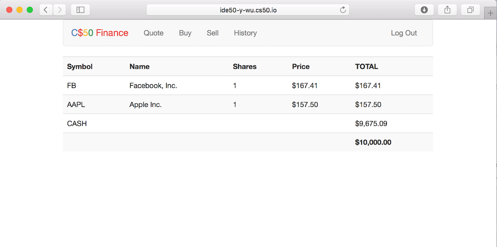

# Building a Finance Web App

Implemented a website via which users can "buy" and "sell" stocks, as shown in the screenshot below. 

## Functions of the website   

The functions implemented in this web app includ: 

- New user registration 
- Log in and log out for existing users
- View holdings and account balance in home page for current user
- Look up a certain stock's price by inputting a stock's symbol  
- Buy and sell stocks 
- Display transaction history 

## Implementation details  

This web app is implemented with Flask in Python 3.6. The data about users, user portfolio, and transaction histories are stored in SQL databases (`finance.db`). 